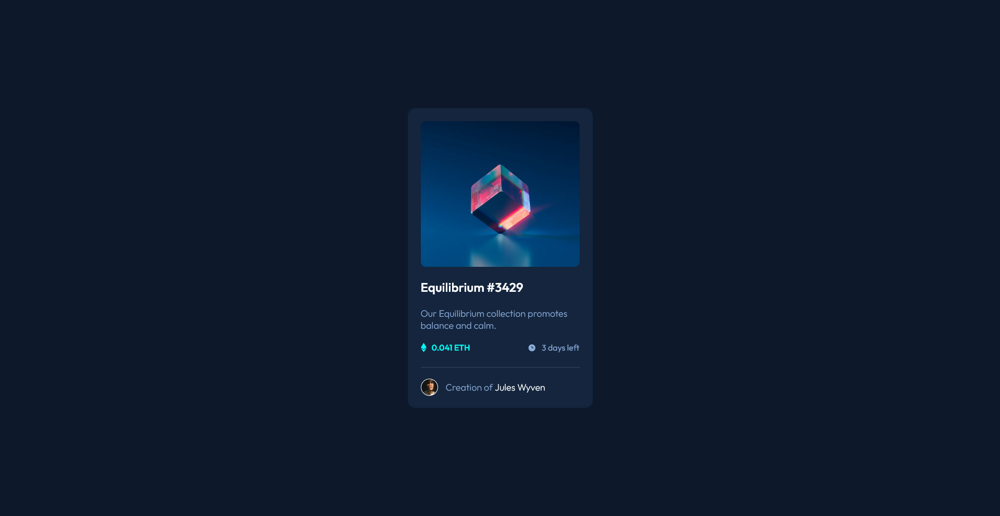

# Frontend Mentor - NFT preview card component solution

This is a solution to the [NFT preview card component challenge on Frontend Mentor](https://www.frontendmentor.io/challenges/nft-preview-card-component-SbdUL_w0U). Frontend Mentor challenges help you improve your coding skills by building realistic projects.

## Table of contents

- [Overview](#overview)
  - [The challenge](#the-challenge)
  - [Screenshot](#screenshot)
- [My process](#my-process)
  - [Built with](#built-with)
  - [What I learned](#what-i-learned)
- [Author](#author)

## Overview

### The challenge

Users should be able to:

- View the optimal layout depending on their device's screen size
- See hover states for interactive elements

### Screenshot

## My process

### Built with

- Semantic HTML5 markup
- CSS3
- Flexbox
- Mobile-first workflow
- SASS

### What I learned

This small project was useful for using pseudo-elements and trying to make it look like, as close as I could, to the design files. Also, I could practice sass a little bit more.

## Author

- Website - [Joaquin Guzman](https://www.joacoguzman.com)
- Frontend Mentor - [@joacoguzmanz](https://www.frontendmentor.io/profile/joacoguzmanz)
- Instagram - [@joacoguzmanz](https://www.instagram.com/joacoguzmanz/)
